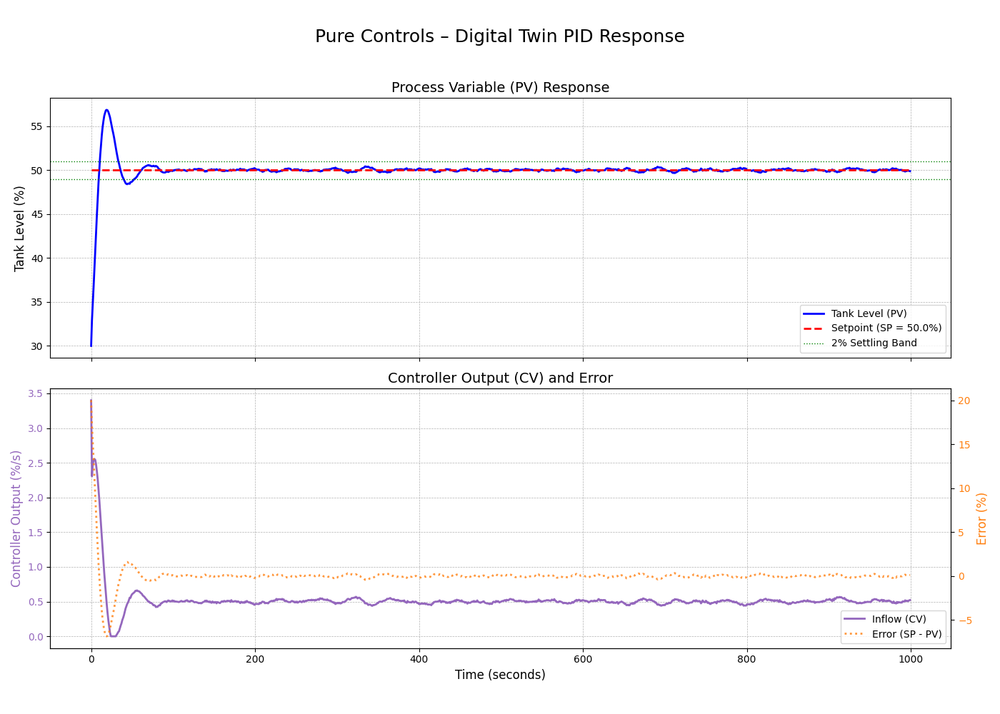

# Pure Controls – Digital Twin PID Controller
*A Python simulation demonstrating how industrial automation systems maintain stable process control using a PID loop.*



## 1. 🎯 Project Overview
This project is a digital twin simulation of a common industrial process: **controlling the liquid level in a process tank**. It's a foundational application in chemical engineering and process control.

The system is built in two parts:
1.  **The Plant (`tank.py`):** A `Tank` class that models the physical dynamics of a tank, including its level, a constant outflow, and random process disturbances (noise).
2.  **The Controller (`pid_controller.py`):** A `PIDController` class that implements the Proportional-Integral-Derivative algorithm, the workhorse of industrial automation.

The controller's sole objective is to maintain the tank's level at a specific **setpoint** (e.g., 50%) by manipulating the **inflow rate** (the control variable). It must achieve this goal despite the constant outflow and random disturbances, demonstrating a closed-loop feedback system.

## 2. 💡 Concept of PID Control
A PID controller is a feedback mechanism that continuously calculates an **error value** $e(t)$ as the difference between the desired **setpoint (SP)** and the measured **process variable (PV)**. It then applies a correction based on three terms:

* **P (Proportional):** Responds to the *current* error. A larger error results in a larger corrective action. `Output = Kp * e(t)`
* **I (Integral):** Responds to the *accumulation* of past errors. This term is essential for eliminating **steady-state error**, ensuring the PV reaches the setpoint exactly. `Output = Ki * ∫e(t) dt`
* **D (Derivative):** Responds to the *rate of change* of the error. This term is predictive, helping to dampen oscillations and reduce overshoot. `Output = Kd * de/dt`

The final controller output is the sum of these three terms:
$$\text{Output}(t) = K_p e(t) + K_i \int_0^t e(\tau) d\tau + K_d \frac{de(t)}{dt}$$


This simulation implements this logic to decide the inflow rate required to hold the tank level steady.

## 3. 🛠️ System Architecture
The project is decoupled into two main scripts, a common practice in engineering workflows:
1.  **`main.py`:** Runs the core simulation. It initializes the `Tank` and `PIDController`, runs the loop for 1000 seconds, calculates key performance metrics (Settling Time, Overshoot), and saves the raw time-series data to `simulation_data.csv`.
2.  **`visualize.py`:** Acts as a post-processing script. It reads `simulation_data.csv`, analyzes the results, and generates the polished `pid_response.png` plot using Matplotlib.

This separation of concerns allows for re-running analysis or generating new plots without having to re-run the entire simulation.

## 4. 🚀 How to Run

### Requirements
* Python 3.10+
* NumPy
* Pandas
* Matplotlib
* Pytest (for testing)

### Installation
1.  Clone the repository:
    ```bash
    git clone [https://github.com/YOUR_USERNAME/pure-controls.git](https://github.com/YOUR_USERNAME/pure-controls.git)
    cd pure-controls
    ```
2.  (Optional but recommended) Create and activate a virtual environment:
    ```bash
    python -m venv venv
    source venv/bin/activate  # On Windows: .\venv\Scripts\activate
    ```
3.  Install the required packages:
    ```bash
    pip install -r requirements.txt
    ```

### Running the Simulation & Visualization
This is a two-step process:

**Step 1: Run the simulation to generate data.**
```bash
python main.py